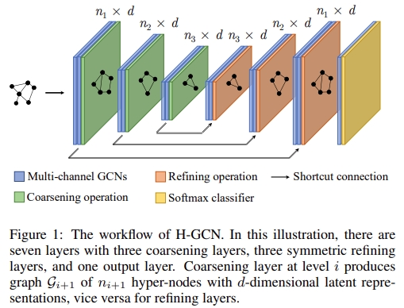

# H-GCN



This is the code for the IJCAI 19 Paper: [Hierarchical Graph Convolutional Networks for Semi-supervised Node Classification](https://dl.acm.org/doi/10.5555/3367471.3367673).

## Usage

You can conduct node classification experiments on citation network (Cora, Citeseer or Pubmed) with the following commands:

```bash
python train.py --dataset cora --epochs 60 --early_stopping 1000 --coarsen_level 4 --dropout 0.85 --weight_decay 7e-4 --hidden 32 --node_wgt_embed_dim 8 --seed1 156 --seed2 136
```

```bash
python train.py --dataset citeseer --epochs 200 --early_stopping 60 --coarsen_level 4 --dropout 0.85 --weight_decay 7e-4 --hidden 30 --node_wgt_embed_dim 15 --seed1 156 --seed2 156
```

```bash
python train.py --dataset pubmed --epochs 250 --early_stopping 1000 --coarsen_level 4 --dropout 0.85 --weight_decay 7e-4 --hidden 30 --node_wgt_embed_dim 8 --seed1 156 --seed2 136
```

## Requirements

- Tensorflow (1.9.0)
- networkx

## Citation

Please cite our paper if you use the code:
```
@inproceedings{10.5555/3367471.3367673,
author = {Hu, Fenyu and Zhu, Yanqiao and Wu, Shu and Wang, Liang and Tan, Tieniu},
title = {Hierarchical graph convolutional networks for semi-supervised node classification},
year = {2019},
isbn = {9780999241141},
publisher = {AAAI Press},
abstract = {Graph convolutional networks (GCNs) have been successfully applied in node classification tasks of network mining. However, most of these models based on neighborhood aggregation are usually shallow and lack the "graph pooling" mechanism, which prevents the model from obtaining adequate global information. In order to increase the receptive field, we propose a novel deep Hierarchical Graph Convolutional Network (H-GCN) for semi-supervised node classification. H-GCN first repeatedly aggregates structurally similar nodes to hyper-nodes and then refines the coarsened graph to the original to restore the representation for each node. Instead of merely aggregating one- or two-hop neighborhood information, the proposed coarsening procedure enlarges the receptive field for each node, hence more global information can be captured. The proposed H-GCN model shows strong empirical performance on various public benchmark graph datasets, outperforming state-of-the-art methods and acquiring up to 5.9\% performance improvement in terms of accuracy. In addition, when only a few labeled samples are provided, our model gains substantial improvements.},
booktitle = {Proceedings of the 28th International Joint Conference on Artificial Intelligence},
pages = {4532–4539},
numpages = {8},
location = {Macao, China},
series = {IJCAI'19}
}
```
